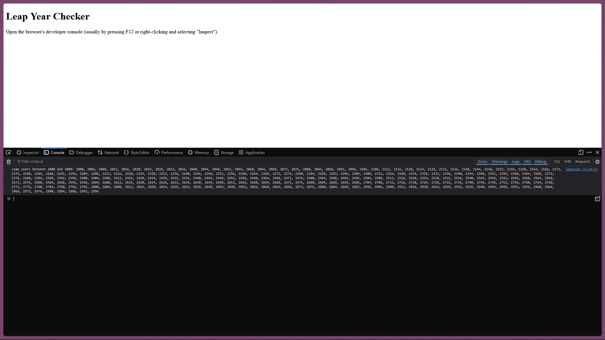

# Leap Year Checker in JavaScript

## What's new?
I've just completed a JavaScript project that checks for leap years! 🌟 The project loops through the years 2000 to 3000 and uses control flow statements to identify and display the leap years. This simple yet educational program helped me practice my skills with variables, control flow, and loops.

## Project Details:
**Description:** The Leap Year Checker program determines whether a year is a leap year based on two conditions:
- The year is divisible by 4 but not by 100.
- The year is divisible by 400.

**Code Implementation:** Here's the JavaScript code I wrote for the project:

```javascript
function isLeapYear(year) {
    // A year is a leap year if it is divisible by 4 but not by 100,
    // or if it is divisible by 400.
    if ((year % 4 === 0 && year % 100 !== 0) || year % 400 === 0) {
        return true;
    } else {
        return false;
    }
}

function displayLeapYears(startYear, endYear) {
    let leapYears = [];
    for (let year = startYear; year <= endYear; year++) {
        if (isLeapYear(year)) {
            leapYears.push(year);
        }
    }
    console.log("Leap years between " + startYear + " and " + endYear + ": " + leapYears.join(", "));
}

// Call the function to display leap years between 2000 and 3000
displayLeapYears(2000, 3000);
```

